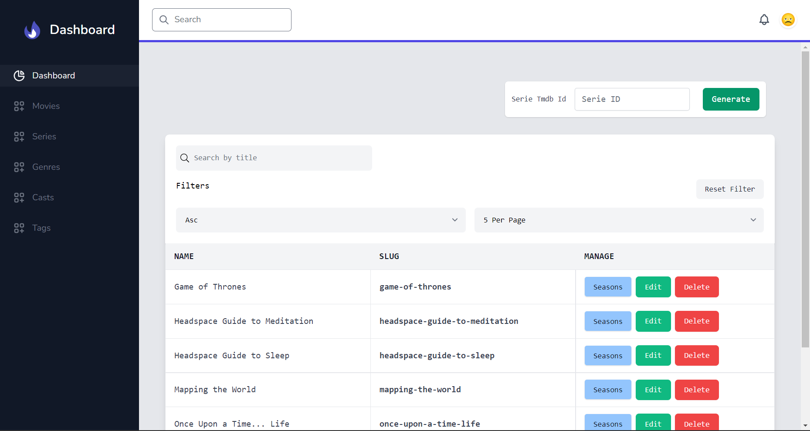
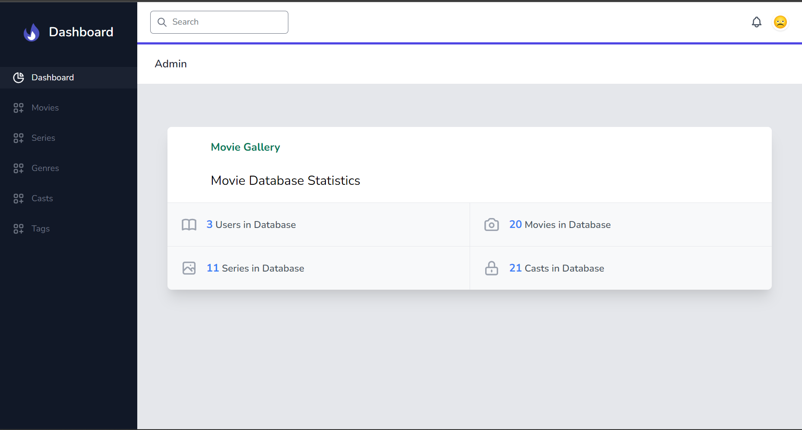
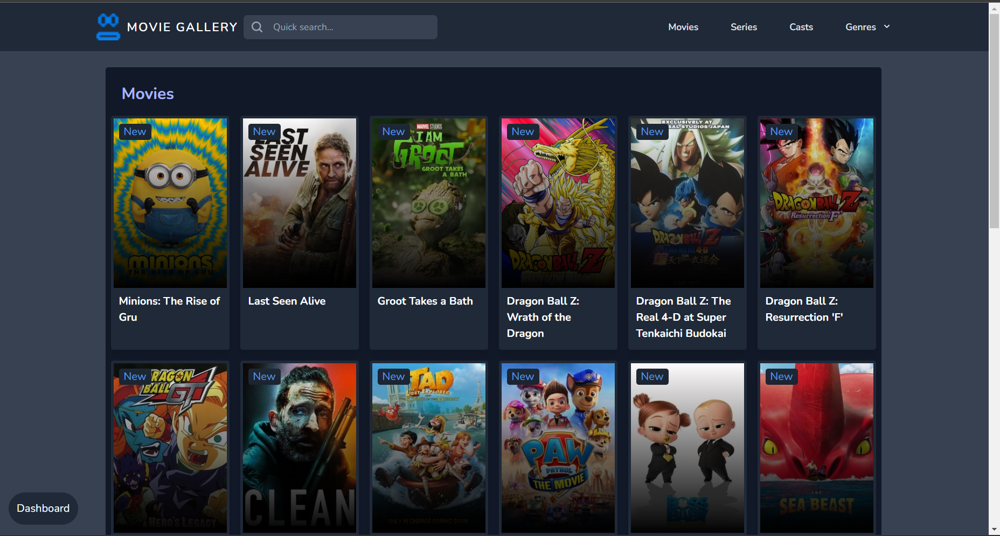

# Movie Gallery

Use DataBase MySQL and Import file  <b> "movie_app.sql" </b> from project file

## Don't forget to like the project 😊😁

 

## How To Use?

<code>composer install</code>
 

Rename<code>.env.example</code> To <code>.env</code>
 

<code>npm install</code>
 

Create DataBase 
* movie_app

Import file from project

*   movie_app.sql

<code>php artisan migrate</code>

<code>php artisan mi:fr</code>

Run in Terminal:

<code>php artisan key:generate</code>

#### I Used

    * Laravel
    * Vue
    * Livewire
    * MySQL
    * Api
    * Tailwind CSS
    * NodeJS
    * API:   https://www.themoviedb.org/
    * And Other Library...

<h4>Admin view</h4>

 

<h4>Admin Details view</h4>

 

<h4>User page</h4>

And Thank you!
