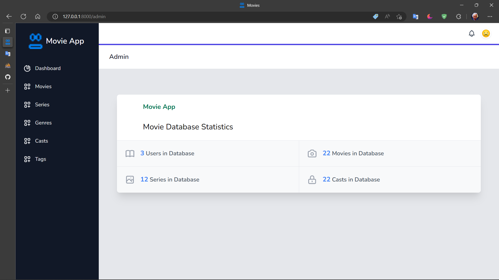
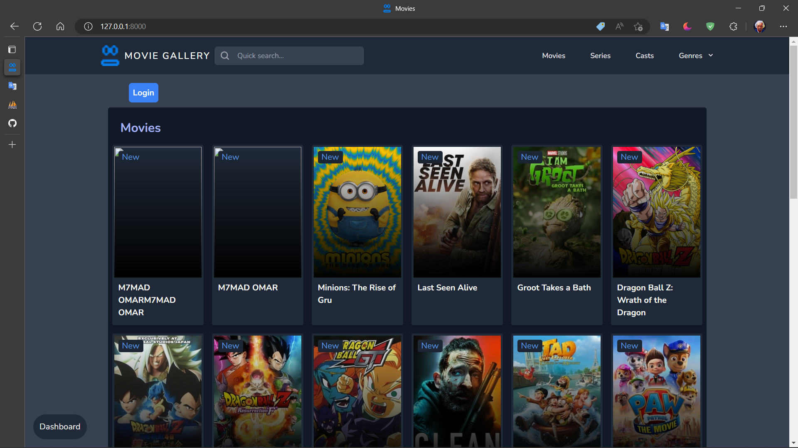

# Movie Gallery

Use DataBase MySQL and Import file  <b> "movie_app.sql" </b> from project file

## Don't forget to like the project 😊😁

 

#### I Used

    * Laravel
    * Vue
    * Livewire
    * MySQL
    * Api
    * Tailwind CSS
    * NodeJS
    * And Other Library...

<h4>Admin view</h4>

 

<h4>Admin Details view</h4>

 

<h4>User page</h4>

And Thank you!
